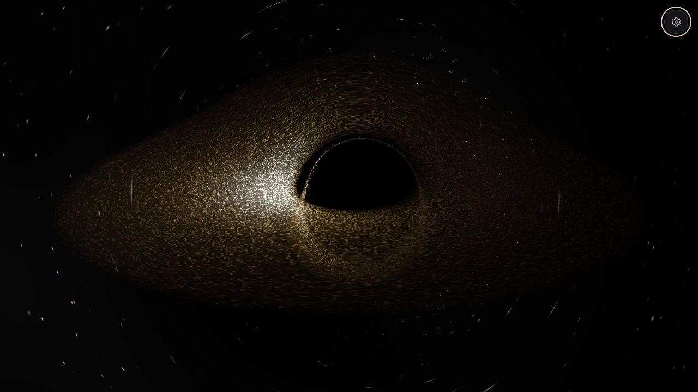

# Interstellar · 黑洞观测站



面向中文浏览器的交互式黑洞展览。在 Kerr–Klein–Newman 时空里逐条积分零测地线，沿完整光路做有限体积广义相对论辐射传输（GRRT），并把热等离子体、偏振与演化吸积流一并算进去。纯静态站点：没有构建步骤，也没有运行时依赖。

- **实时光线积分**：入向／外向双 Kerr–Schild 坐标图，Bogacki–Shampine 3(2) 嵌入步进（FSAL 复用接受终点），未收敛与无效光线显式区分。
- **物理辐射传输**：热同步辐射、吸收、法拉第旋转与转换、四分量 Stokes 矩阵指数；纯强度热盘另走独立标量核，不构建偏振基底。
- **类时观察者**：E=1、L=0 的自由落体世界线，按固有时间推进，含运动像差与频移；也可选视界外静止观察者。
- **十个场景**：从光学热盘到射电热流、喷流、逆行盘、带电黑洞与规定轨道热点。
- **本地生成的 GRMHD 片段**：由固定提交的 Illinois iharm2d_v3 产出，站点只分发数值记录与来源。
- **可访问性与偏好**：默认收起的原生 details 面板、原生 select/range、完整键盘路径、Esc 收起并归还焦点，跟随「减少动态效果」。

## 场景预设

| 预设 | 吸积流 | 说明 |
| --- | --- | --- |
| 类星体 · 光学热盘 | 热盘 | 超大质量黑洞，可见光波段 |
| 恒星级 · X 射线热盘 | 热盘 | X 射线波段显色 |
| M87* · 射电热流与喷流 | GRMHD | 230 GHz，偏振可用 |
| 银河系中心 · 射电热流 | GRMHD | 230 GHz，显示增益 200 |
| 喷流基部 · 侧面观察 | GRMHD | 侧面视角观察喷流基部 |
| 逆行盘 · 反向自旋 | 热盘 | 负自旋 |
| 近极端克尔 · 内缘与细环 | 热盘 | a=0.998 |
| 孤立黑洞 · 星空透镜 | 无盘 | 只留引力透镜星空 |
| 带电黑洞 · 理论对照 | 热盘 | Kerr–Newman，Q≠0 |
| 轨道热点 · 光路时延示例 | 热盘 | 规定方位热点，展示光路时延 |

## 科学模型与代码位置

| 文件 | 职责 |
| --- | --- |
| `dist/relativity.js` | 双 Kerr–Schild 坐标、带电与正负自旋、带误差估计的积分、类时观察者、偏振向量的平行移动 |
| `dist/astrophysics.js` | 物理质量／吸积率、广义薄盘通量、混合气体／辐射压力与熵守恒内流、Planck 与 CIE 光谱、自由落体世界线与取景 |
| `dist/plasma.js` | 热同步辐射、吸收、法拉第旋转／转换、四分量 Stokes 矩阵指数、经 SHA-256 核验的 GRMHD 读取 |
| `dist/physical-renderer.js` | WebGL2 有限体积光线传输求解器与显示链（唯一现代渲染路径） |
| `dist/app.js` | 共享状态、参数校验与原子应用、页面生命周期与可见性、空闲绕转抑制、WebMCP 工具 |
| `dist/navigation.js` | 统一 Pointer／Wheel／GestureEvent 手势、缩放边界、镜头缓动、空闲绕转步进 |
| `dist/physics.js`、`dist/geodesics.js`、`dist/raytracer.js` | 保留的历史基准，以及 Canvas 兼容画面共享的科学核心 |
| `tools/generate-grmhd.py` | 可复现地生成并打包 GRMHD 片段与元数据 |
| `dist/notices.txt` | 参考来源与第三方许可 |

逐效果的数学模型、代码位置、文献出处与已知简化写在 [`PHYSICS.md`](PHYSICS.md)；主题、控件约定与 token 映射见 [`DESIGN.md`](DESIGN.md)；方案与实现记录见 [`AGENT.md`](AGENT.md)。

## 快速开始

发布产物就是 `dist/`，直接静态服务即可（`.openai/hosting.json` 也指向该目录）：

```bash
python3 -m http.server 8765 --bind 127.0.0.1
# 打开 http://127.0.0.1:8765/dist/
```

运行环境要求：

- 现代浏览器 + **WebGL2**，并支持 `EXT_color_buffer_float`。缺少时自动进入 Canvas 兼容投影，界面会明确标注：该路径不含引力透镜，也不计算视界内观察。
- GRMHD 场景首次使用时会下载约 **6.9 MiB** 的热流片段并按元数据校验 SHA-256，需要 `DecompressionStream` 与 `SubtleCrypto`，即 **安全上下文**（`localhost` 或 https）。校验失败会在面板中报告，而不是静默降级。

## 检查与验证

科学核心与交互逻辑用无依赖的 Node 检查（不需要浏览器）：

```bash
node checks/physical-core.cjs      # ISCO、96 组类时观察者与注入、双图零标架、哈密顿梯度、捕获边界、守恒逃逸、固有时间落体、质量守恒、光谱、Stokes 传输、GRMHD 记录完整性
node checks/render-physics.cjs     # 历史渲染核心：盘面分布、观察者标架、零测地线、着色器结构 lint
node checks/navigation.cjs         # 手势、去重、缩放边界、缓动、近视界标架
node checks/idle-drift.cjs         # 空闲绕转、指针／原生手势生命周期、预设与参数原子拒绝、旅程恢复
node checks/plunge-particles.cjs   # 坠落类时归一化、E/L 守恒、近视界频移、轨迹单调性
```

真实 GPU 的浏览器检查需要 Playwright 驱动程序与本机 Chrome（可用 `PLAYWRIGHT_MODULE`、`CHROME_EXECUTABLE` 指向宿主已有的副本，不写入项目依赖），以及一个本地静态服务（基线端口服务 `verification/thermal/baseline` 的原始快照）：

```bash
export PLAYWRIGHT_MODULE=/path/to/playwright   # 宿主自带的包即可，不写入项目依赖
node checks/physical-browser.cjs http://127.0.0.1:8765
THERMAL_SKIP_PERFORMANCE=1 node checks/thermal-acceptance.cjs http://127.0.0.1:8765 http://127.0.0.1:8766
node checks/thermal-performance.cjs http://127.0.0.1:8765 http://127.0.0.1:8766
```

浏览器检查的判定口径：所有场景的未收敛光线与无效光线必须为 0，GPU 浮点系数与双精度 CPU 对照的相对差 <0.1%，偏振误差受限，并且逐变体断言实际光线数与积分档位一致（转换矩阵的 Stokes 光锥约束在 `physical-core.cjs` 中独立验证）。完整数值、截图与复现记录写入被忽略的 `verification/`。

## GRMHD 数据与可复现性

`dist/data/grmhd-torus.*` 是本地生成的轴对称片段，不是外部下载的观测数据：

- 由 `tools/generate-grmhd.py` 在临时目录克隆并固定 `AFD-Illinois/iharm2d_v3` 提交 `bfa06d2cbabf2c8cd94c1711d04fd468397e9aee`，以 64×64、a=0.9375、Q=0、t=0..800 运行。
- 站点只分发 41 帧数值记录（密度、内能、四速度、磁场）与其来源说明，**不打包上游求解器源码**；解压后约 7.7 MiB。
- 元数据记录 `sha256`、字节数、div B 与四速度归一化误差；浏览器侧按同一哈希校验后才使用。`node checks/physical-core.cjs` 会重新校验二进制与元数据的一致性。
- 记录的极向拉伸系数 `thetaSlope` 必须与生成器写入数据时所用的一致，检查中有对应断言。

## 已知边界与简化

本项目刻意不宣称超出其实现范围的能力，当前明确的保留项：

- GRMHD 为 **64×64、轴对称、有限片段**，未做持续演化的三维 GRRMHD；质量与吸积率是示意配置，**不是**对 M87* 或银河系中心的观测拟合。
- 电子温度与局部同步辐射为文献拟合处方；灰大气不含完整多次散射或返回辐射。
- 热盘是解析稳态模型，含有限内缘应力、灰消光与注入速度等模型参数，不由 MRI 自洽导出。
- 采样以有限光线预算推进，未收敛／无效光线作为显式状态报告，不混入阴影。
- 两项已声明未达标的验收项：0° 侧视的边界图像在 2048 r_g 域下仍未收敛；扩域后的净性能目标 25% 未达到（实测 10.9% / 22.9%）。
- 曝光与显示增益只作用于显示阶段，不代表光度标定。

## 目录结构

```
dist/        发布目录，唯一静态产物
checks/      Node 与浏览器检查
tools/       GRMHD 生成脚本
verification/ 检查证据与截图（已在 .gitignore 中忽略）
AGENT.md PHYSICS.md DESIGN.md  方案记录、科学依据、设计约定
```

## 文档与许可

- [`PHYSICS.md`](PHYSICS.md)：逐效果的科学依据，含保留的简化与验收限制。
- [`DESIGN.md`](DESIGN.md)：主题、语言、控件与动态效果约定。
- [`AGENT.md`](AGENT.md)：方案与每轮实现记录。
- [`dist/notices.txt`](dist/notices.txt)：参考来源与第三方许可全文。要点：`physics.js` 的 Page–Thorne 通量表达式改编自 grtrans（MIT，附完整声明）；NPGS 仅作为自适应积分与分阶段渲染的**参考**，未包含其源码（GPL-3.0）；oseiskar/black-hole（GPL）与 rantonels/starless（MIT）作为背景透镜与多重星像的呈现参照；论文引用见该文件。

仓库当前没有顶层 `LICENSE` 文件，第三方组件的许可条款以上述 `dist/notices.txt` 为准。
